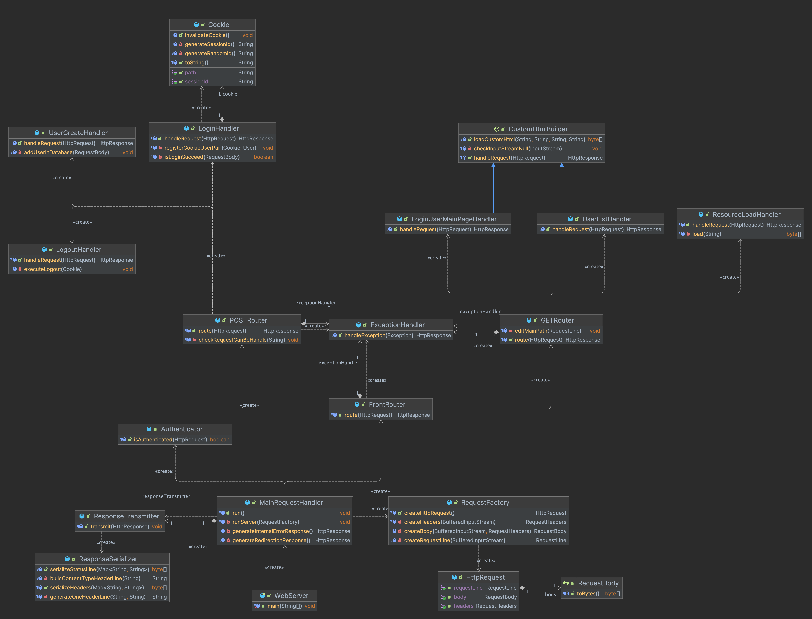
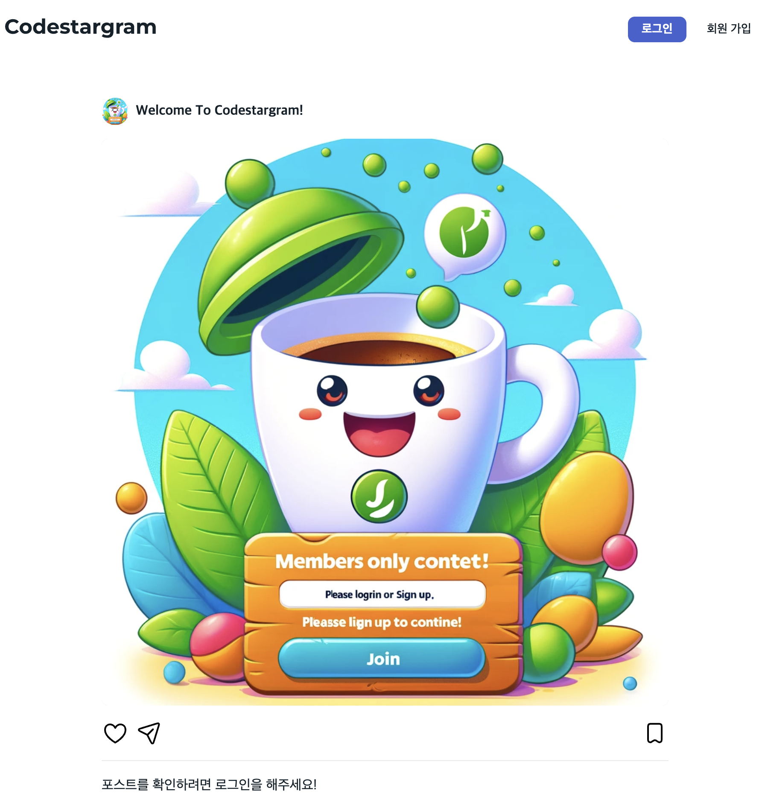
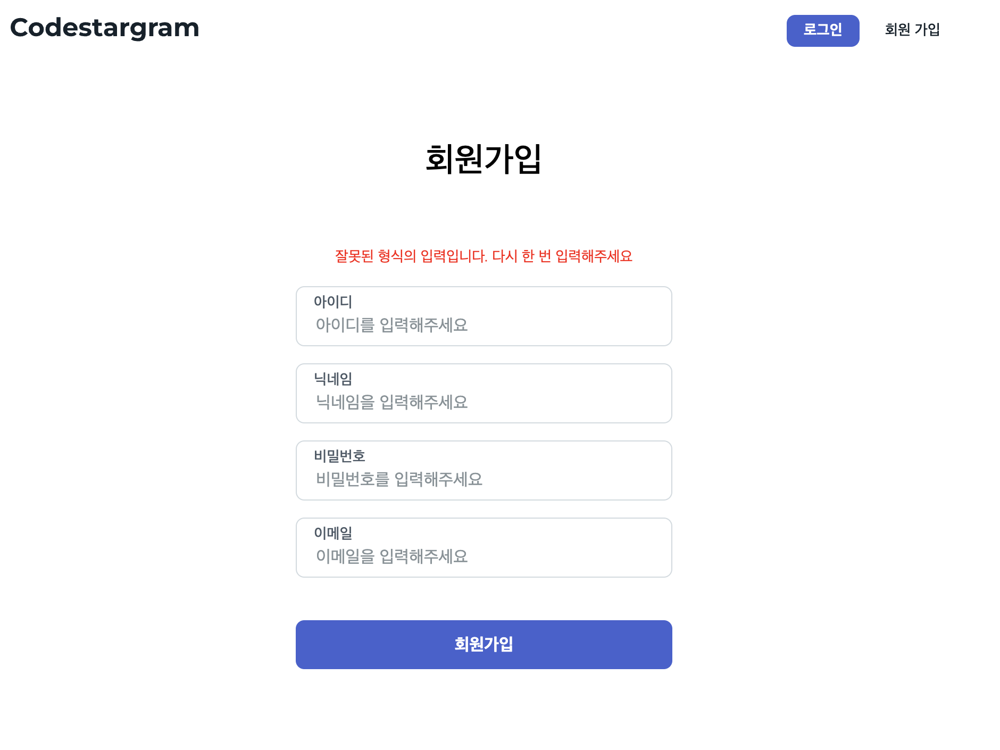
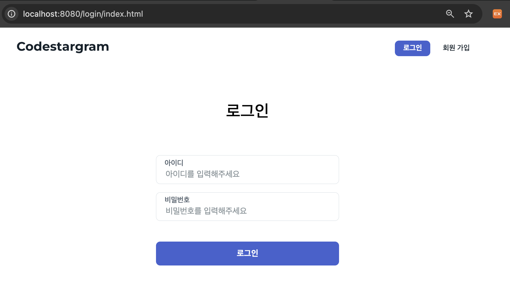
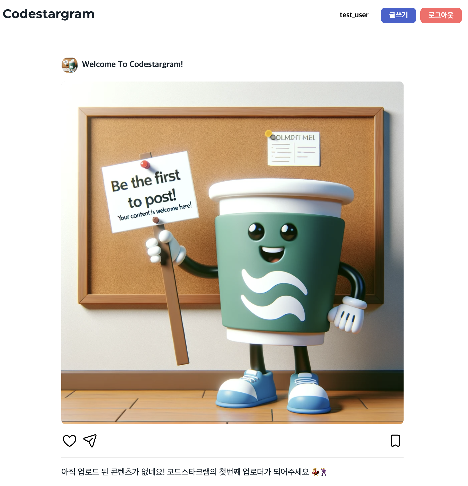
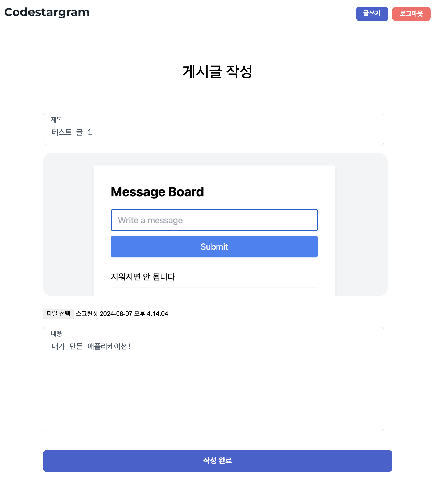
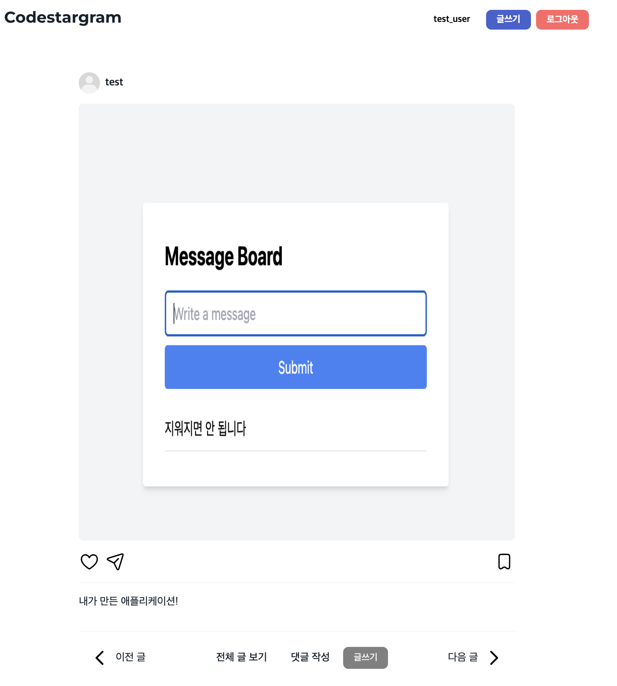

# 바닐라 Java를 활용한 Web Application Server

### 실행 방법

**1. 소스코드 클론**
```shell
git clone https://github.com/seedspirit/be-was-neon.git
```

**2. Gradle 빌드 후 jar 파일 실행**
```shell
cd be-was-neon
./gradlew build
java -jar ./build/libs/be-was-neon-1.0-SNAPSHOT.jar
```

**3. 브라우저에서 localhost:8080/index.html로 접속**


### 🛠️ 주요 기능
- 진입 시 index.html 반환
- 회원가입
  - 아이디 중복 체크, 이메일과 이름 형식 체크
- 세션, 쿠키를 활용한 로그인, 로그아웃
- 인증되지 않은 상태로 로그인 시도할 경우 로그인 페이지로 리다이렉트
- multipart-form 형식의 게시글 업로드 (업로드 시간 역순으로 게시글 정렬)


### 📊 클래스 다이어그램
<div align=center>

</div>

<br>

### 📷 구현 화면

<div class="display: flex; flex-direction: column; align-items: center;">
   
    
    
    
    
    
</div>


